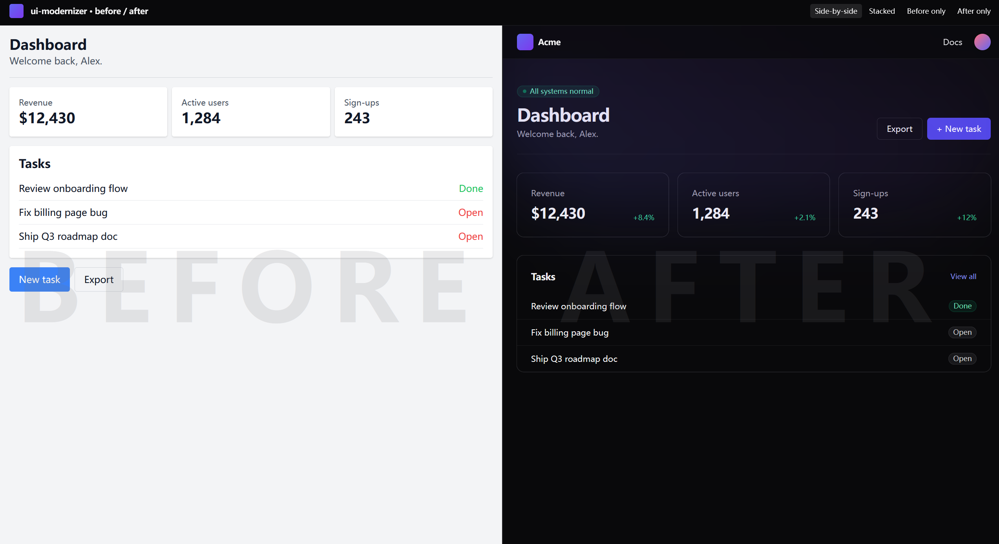

<div align="center">

[English](./README.md) · **简体中文**

# ✨ ui-modernizer

### 一句话提示，UI 焕然一新。

**一个 Claude Code Skill，把你的旧 React + Tailwind UI 一键升级成 2026 年的 SaaS 产品级界面。**
Linear · Vercel · Stripe · shadcn —— 挑一个风格，直接拥有同款质感。

```
"modernize this UI"
```

<br />

<!-- 录完替换 -->


<br />

[](https://www.npmjs.com/package/ui-modernizer)
[](./LICENSE)
[](https://claude.com/claude-code)
[](https://github.com/Rosalina7515/ui-modernizer/stargazers)

</div>

---

## 🤯 Before / After 对比

<div align="center">



*同一份组件树，同一份业务逻辑，0 行 handler 被改动。*
*只动 `className`、design tokens 和 globals.css。*

</div>

---

## 🚀 10 秒安装

```bash
npx ui-modernizer
```

完事。这个 Skill 已经装进你的 Claude Code，所有项目都能调用。

然后在 Claude Code 里，任何 React + Next.js + Tailwind 项目中输入：

```
modernize this UI
```

Claude 接管剩下的所有事情。

---

## 🎯 你将得到什么

| | 之前 | 之后 |
|---|---|---|
| Spacing | 到处 `p-2 m-2` | 系统化的 4 / 6 / 8 节奏 |
| Color | `gray-*` + `blue-500` | zinc + indigo + 品牌色自适应 |
| Radius | `rounded` | 按元素分配 `rounded-md` / `rounded-xl` |
| Shadow | `shadow` | `shadow-sm` + `ring-1 ring-zinc-200` |
| Hover | 无 | 每个交互元素都有 `transition-colors hover:bg-zinc-50` |
| Focus | 看不见 | `focus-visible:ring-2 ring-indigo-500` |
| Dark mode | 不存在 | 每个颜色都有 `dark:` 变体 |
| Motion | 没有 | `animate-in fade-in slide-in-from-bottom-2` |
| Typography | `font-bold` 嘶吼 | `font-semibold tracking-tight` 低语 |

挑一个风格：

```
modernize this UI like Linear
modernize this UI like Vercel
modernize this UI like Stripe
modernize this UI like shadcn
```

---

## 🛡️ 设计上就安全

ui-modernizer **只动你的视觉层**：

- ✅ `className` 字符串内容
- ✅ 仅用于布局的 wrapper `<div>`（只增不减）
- ✅ `globals.css`、`tailwind.config`
- ❌ 事件 handler
- ❌ state、effect、fetch、server action
- ❌ props 和组件签名
- ❌ 任何可能搞坏你应用的东西

每一次运行都是：

1. **有 plan** —— 改之前先告诉你要改哪些文件。
2. **有备份** —— 完整备份到 `.ui-modernizer-backup/<时间戳>/`。
3. **有 diff** —— 生成 `report.md`，包含逐文件 `+/-` 行数 + 前后截图。
4. **可回滚** —— 一行命令：

```bash
npx ui-modernizer rollback
```

---

## 📸 自动截图（可选）

如果你装了 [Playwright](https://playwright.dev)，ui-modernizer 会自动拉起 dev server、抓取所有可发现的路由、拼出 before/after 对比图。README 级别的画质，0 手工。

```bash
npm install -D playwright sharp
npx playwright install chromium
```

没装也没关系 —— 改 UI 照样跑，截图直接跳过。

---

## ⚙️ 它是怎么工作的

```
┌──────────┐   ┌──────────┐   ┌──────────┐   ┌──────────┐
│ DETECT   │ → │ PLAN     │ → │ BACKUP   │ → │ SHOOT #1 │
│ 检测技术栈 │   │ 列改动文件│   │ 备份原文件│   │ 截 before│
└──────────┘   └──────────┘   └──────────┘   └──────────┘
                                                   ↓
┌──────────┐   ┌──────────┐   ┌──────────┐   ┌──────────┐
│ DONE     │ ← │ REPORT   │ ← │ SHOOT #2 │ ← │ APPLY    │
│ ✨        │   │ .md 报告 │   │ 截 after │   │ 改 UI    │
└──────────┘   └──────────┘   └──────────┘   └──────────┘
```

知识被拆成多个 Markdown 文件，Claude 按需加载 —— 这意味着：

- **Fork** 整个 skill，编辑 `references/style-references/<你的品牌>.md`，就有了一个定制版 modernizer。
- **审计**：AI 套用的每一条规则都用大白话写在 `references/tailwind-modernization.md` 里。

---

## 📦 支持的技术栈（MVP）

| | 状态 |
|---|---|
| React | ✅ |
| Next.js（App Router） | ✅ |
| Next.js（Pages Router） | ✅ |
| Tailwind CSS v3+ | ✅ |
| Tailwind CSS v4 | 🛠 即将支持 |
| Vue + Tailwind | 🛠 v0.3 |
| Svelte + Tailwind | 🛠 v0.3 |
| styled-components | ❌ 不在范围 |
| CSS Modules | ❌ 不在范围 |

---

## 🧪 用内置 demo 体验

```bash
git clone https://github.com/Rosalina7515/ui-modernizer
cd ui-modernizer/examples/before && npm install && npm run dev
# → http://localhost:3000  （故意做得很丑）

cd ../after && npm install && npm run dev
# → http://localhost:3001  （ui-modernizer 改完的样子）
```

---

## 🗺️ Roadmap

- [ ] **v0.2** —— Tailwind v4 支持，自动检测品牌色
- [ ] **v0.3** —— Vue 3 + Svelte 5 支持
- [ ] **v0.4** —— 可插拔的风格 profile（社区贡献品牌）
- [ ] **v0.5** —— 组件级替换（自动 install shadcn primitives）
- [ ] **v1.0** —— 视觉回归测试（对照设计规范）

---

## 🤝 贡献

ui-modernizer 本质上是 **prompt + Markdown 规则**。新增一种审美只需要一个 PR：

1. 创建 `references/style-references/<your-style>.md`
2. 写一段简短的 "什么场景用这个 style" 说明
3. 可选：把 before/after 截图放进 `assets/`

不需要构建、不需要测试、不需要 TypeScript 仪式感。开 PR 就完事。

---

## ❓ FAQ

**它会调用外部 API 吗？**
不会。完全运行在你本地的 Claude Code 里，代码不会离开你的机器。

**它会动我的业务逻辑吗？**
设计上不会。`SKILL.md` 里有硬性禁区禁止，每次运行都会产出可审计的 diff。

**改完结果我不喜欢怎么办？**
`npx ui-modernizer rollback` —— 所有改动的文件都会从带时间戳的备份里恢复。

**不用 Tailwind 行不行？**
MVP 阶段不行。CSS Modules 和 styled-components 在 roadmap 上（v0.4+）。

**为什么是 Skill 而不是 CLI？**
这里的视觉判断离不开 LLM。纯 CLI 只能做 dumb 的正则替换；Skill 一边利用 Claude 的设计品味，一边把副作用（截图、备份、diff）保持成确定性的。

---

## 🌟 Star History

[](https://star-history.com/#Rosalina7515/ui-modernizer&Date)

---

<div align="center">

**一个为重视 UI 细节的开发者打造的开源项目。**

[MIT](./LICENSE)

</div>
